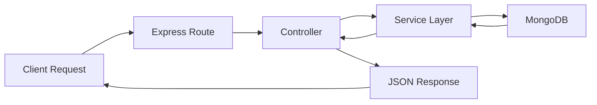
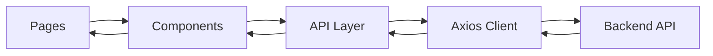
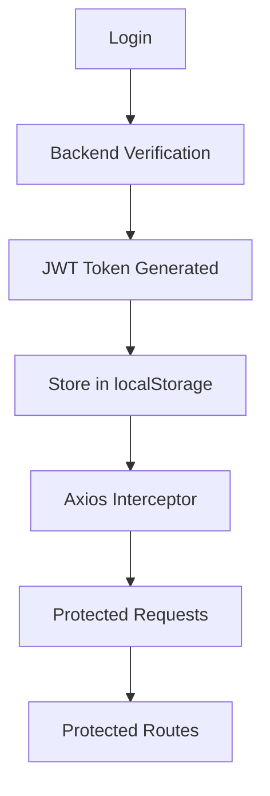

<div align="center">

# 🚀 ThreadForge

### A Full-Stack Discussion Platform with Recursive Comments & Credit-Based Engagement

Built with **React**, **TypeScript**, **Node.js**, **Express**, **MongoDB**, and a custom **Credit Reward System** designed around nested discussions.

<br/>


</div>

---

## 📖 Overview

ThreadForge is a full-stack discussion platform inspired by community-driven forums and threaded conversations.

Users can:

* Create accounts
* Authenticate using JWT
* Create discussion posts
* Participate in threaded conversations
* Reply to comments recursively
* Earn credits through community engagement
* Experience automatic credit rollback when comments are deleted

The project demonstrates modern full-stack development principles including:

* REST API architecture
* Authentication & authorization
* Recursive data structures
* Type-safe frontend and backend development
* State management
* API integration
* Credit-based business logic

---

## ✨ Core Features

### Backend Features

* JWT Authentication
* Protected Routes
* MongoDB + Mongoose
* User Management
* Post Management
* Recursive Comment Support
* Credit Reward System
* Credit Rollback Logic
* Soft Delete Comments
* Input Validation
* Error Handling Middleware
* TypeScript Support

### Frontend Features

* React SPA (Single Page Application)
* React Router
* TypeScript
* Context API Authentication
* Protected Pages
* Axios API Layer
* Auto Login
* JWT Persistence
* Recursive Comment Rendering
* Nested Discussion Threads
* Responsive UI
* TailwindCSS Styling

---

## 🏗️ System Architecture

### Backend Request Flow



---

### Frontend Architecture



---

### Authentication Flow



---

## 📂 Project Structure

```text
ThreadForge/
│
├── forum-backend/
│   ├── src/
│   │   ├── config/
│   │   ├── controllers/
│   │   ├── middleware/
│   │   ├── models/
│   │   ├── routes/
│   │   ├── services/
│   │   ├── types/
│   │   ├── utils/
│   │   ├── app.ts
│   │   └── server.ts
│   │
│   ├── dist/
│   ├── package.json
│   └── tsconfig.json
│
├── forum-frontend/
│   ├── src/
│   │   ├── api/
│   │   ├── assets/
│   │   ├── components/
│   │   ├── context/
│   │   ├── hooks/
│   │   ├── pages/
│   │   ├── routes/
│   │   ├── types/
│   │   ├── utils/
│   │   ├── App.tsx
│   │   └── main.tsx
│   │
│   ├── public/
│   ├── package.json
│   └── vite.config.ts
│
├── README.md
└── .gitignore
```

---

## 🛠️ Tech Stack

| Layer             | Technologies                         |
| ----------------- | ------------------------------------ |
| Frontend          | React, TypeScript, Vite, TailwindCSS |
| Routing           | React Router                         |
| State Management  | Context API                          |
| API Communication | Axios                                |
| Backend           | Node.js, Express                     |
| Database          | MongoDB, Mongoose                    |
| Authentication    | JWT                                  |
| Language          | TypeScript                           |
| Version Control   | Git & GitHub                         |

---

## ⚙️ Installation & Setup

### Clone Repository

```bash
git clone https://github.com/<your-username>/ThreadForge.git

cd ThreadForge
```

---

## Backend Setup

```bash
cd forum-backend

npm install
```

Create a `.env` file:

```env
PORT=5000

MONGO_URI=your_mongodb_connection_string

JWT_SECRET=your_secret_key

JWT_EXPIRES_IN=7d

CREDIT_FIRST_TERM=1

CREDIT_COMMON_DIFFERENCE=2
```

Run backend:

```bash
npm run dev
```

Build backend:

```bash
npm run build
```

---

## Frontend Setup

```bash
cd forum-frontend

npm install
```

Run frontend:

```bash
npm run dev
```

Build frontend:

```bash
npm run build
```

---

# 📡 API Overview

## Authentication

| Method | Endpoint           | Description           |
| ------ | ------------------ | --------------------- |
| POST   | `/api/auth/signup` | Register a new user   |
| POST   | `/api/auth/login`  | Login and receive JWT |

---

## Users

| Method | Endpoint        | Description                    |
| ------ | --------------- | ------------------------------ |
| GET    | `/api/users/me` | Get current authenticated user |

---

## Posts

| Method | Endpoint         | Description       |
| ------ | ---------------- | ----------------- |
| GET    | `/api/posts`     | Get all posts     |
| GET    | `/api/posts/:id` | Get a single post |
| POST   | `/api/posts`     | Create a new post |

---

## Comments

| Method | Endpoint                     | Description                 |
| ------ | ---------------------------- | --------------------------- |
| GET    | `/api/comments/post/:postId` | Get all comments for a post |
| POST   | `/api/comments`              | Create root comment         |
| POST   | `/api/comments/reply`        | Create nested reply         |
| DELETE | `/api/comments/:id`          | Soft delete comment         |

---

# 💰 Credit System Logic

One of the unique features of ThreadForge is its engagement-based credit system.

Instead of awarding fixed credits for every interaction, comment rewards follow an Arithmetic Progression.

### Formula

```text
Reward = First Term + (Depth - 1) × Common Difference
```

Current configuration:

```text
First Term = 1
Common Difference = 2
```

---

### Example

| Comment Depth | Reward    |
| ------------- | --------- |
| Root Comment  | 1 Credit  |
| Reply Level 1 | 3 Credits |
| Reply Level 2 | 5 Credits |
| Reply Level 3 | 7 Credits |
| Reply Level 4 | 9 Credits |

---

### Example Thread

```text
Post
│
├── Comment A (+1)
│
└── Comment B (+3)
     │
     └── Comment C (+5)
```

Total Credits Earned:

```text
1 + 3 + 5 = 9 Credits
```

These credits are awarded to the original post author.

---

## Credit Rollback

When a comment is deleted:

* The comment remains in the database.
* The reward associated with that comment is removed from the post author's credits.
* Thread structure remains intact.

Example:

```text
Credits Before Delete = 9

Delete Comment C

Credits After Delete = 4
```

---

# 🌳 Recursive Comment System

ThreadForge supports unlimited nested replies.

Comments are stored in MongoDB using a parent-child relationship.

Example:

```json
{
  "_id": "comment-b",
  "parentCommentId": "comment-a"
}
```

---

## Backend Storage Structure

```text
Comment A
│
└── Comment B
     │
     └── Comment C
```

Stored as:

```text
A → parent = null

B → parent = A

C → parent = B
```

---

## Frontend Tree Builder

The backend returns comments as a flat array.

Example:

```text
A
B (parent A)
C (parent B)
D
```

The frontend converts this into:

```text
A
└── B
     └── C

D
```

using:

```text
buildCommentTree()
```

located inside:

```text
src/utils/buildCommentTree.ts
```

---

## Rendering Strategy

The UI uses recursive React components.

```text
CommentItem
└── CommentItem
     └── CommentItem
          └── CommentItem
```

This allows unlimited nesting depth while keeping the code simple and scalable.

---

# 🧠 Challenges Faced

During development several engineering challenges were encountered.

---

### Recursive Comment Design

Designing a system capable of supporting unlimited nested replies required careful consideration of:

* Parent-child relationships
* Database schema design
* Depth calculations
* UI rendering

---

### Credit Reward Calculation

The reward system needed to:

* Scale with nesting depth
* Remain predictable
* Support rollback
* Prevent incorrect credit calculations

An Arithmetic Progression model was chosen because it remains simple while encouraging deeper discussions.

---

### Frontend State Synchronization

User credits must update instantly after:

* Creating comments
* Replying
* Deleting comments

This required coordinated updates between:

* Backend API
* React Context
* Component State

---

### Authentication Persistence

Users should remain logged in after page refresh.

This was implemented using:

* JWT Tokens
* localStorage
* Axios Interceptors
* Context API
* Auto User Validation

---

### Recursive UI Rendering

Rendering deeply nested discussions while preserving thread structure required:

* Tree building algorithms
* Recursive components
* Dynamic indentation

---

# 🐛 Debugging & Issues Resolved

Several real-world issues were identified and resolved during development.

---

### Missing Comment Route

Issue:

```text
GET /api/comments/post/:postId

returned

Route Not Found
```

Cause:

The route existed in the service layer but was not exposed through Express routes and controllers.

Resolution:

Added:

```text
GET /comments/post/:postId
```

controller and route integration.

---

### Invalid JWT Header

Issue:

```text
Invalid or expired token
```

Cause:

Bearer token was wrapped in quotation marks.

Resolution:

Removed quotes and sent:

```text
Authorization: Bearer token_here
```

---

### Frontend-Backend Connectivity

Issue:

Frontend could not communicate with backend.

Cause:

Incorrect API routing configuration.

Resolution:

Configured Vite proxy and centralized Axios client.

---

### Comment Tree Rendering

Issue:

Nested replies were displayed as flat comments.

Resolution:

Implemented:

```text
buildCommentTree()
```

using a two-pass Map-based approach.

---

### Credit Rollback Validation

Issue:

Needed to ensure credits were correctly removed when comments were deleted.

Resolution:

Extensive testing confirmed:

```text
Create Comment
→ Add Credits

Delete Comment
→ Remove Credits
```

worked correctly.

---

# 📚 What We Learned

This project provided hands-on experience with modern full-stack application development.

Key learning outcomes included:

### Backend

* Express Architecture
* Service Layer Pattern
* MongoDB Relationships
* JWT Authentication
* Middleware Design
* Error Handling
* TypeScript in Backend Development

### Frontend

* React Component Architecture
* Context API
* Protected Routes
* React Router
* Axios Interceptors
* Recursive Rendering
* State Synchronization

### Full Stack

* API Design
* Client-Server Communication
* Authentication Workflows
* Production Builds
* Debugging Strategies
* End-to-End Testing

---

# 🚀 Future Improvements

Potential enhancements for future versions of ThreadForge:

---

### Community Features

* User Profiles
* Profile Pictures
* Follow System
* User Reputation
* Leaderboards

---

### Content Features

* Rich Text Editor
* Markdown Support
* Image Uploads
* File Attachments
* Post Categories
* Tags

---

### Real-Time Features

* Live Notifications
* WebSockets
* Real-Time Comments
* Live Credit Updates

---

### AI Features

* AI Content Moderation
* Toxicity Detection
* AI Discussion Summaries
* AI Topic Suggestions
* AI-Powered Search

---

### Platform Improvements

* Search & Filtering
* Pagination
* Infinite Scrolling
* Dark Mode
* Better Mobile Experience

---

### Engineering Improvements

- Docker Support
- CI/CD Pipeline
- Unit Testing
- Integration Testing
- API Documentation
- Redis Caching
- Rate Limiting

---

# 🚀 Running the Application

## Start the Backend

```bash
cd forum-backend

npm install

npm run dev
```

The backend will start on the configured port (default: `5000`).

---

## Start the Frontend

```bash
cd forum-frontend

npm install

npm run dev
```

The frontend will start using Vite's development server.

---

## Production Builds

### Backend

```bash
cd forum-backend

npm run build
```

### Frontend

```bash
cd forum-frontend

npm run build
```

Both applications were successfully built and validated before submission.

---

# 🤝 Acknowledgements

This project was built as part of a full-stack internship assignment focused on:

- Backend API Design
- Authentication & Authorization
- Recursive Data Structures
- Business Logic Implementation
- React SPA Development
- TypeScript Adoption
- End-to-End Integration

The goal was not only to build a working application, but also to understand the architecture, reasoning, debugging process, and engineering decisions behind it.

---

<div align="center">

### Built with React • TypeScript • Express • MongoDB

ThreadForge — A Full-Stack Discussion Platform Featuring Recursive Conversations and Credit-Based Engagement

</div>